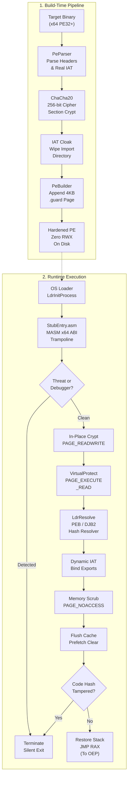
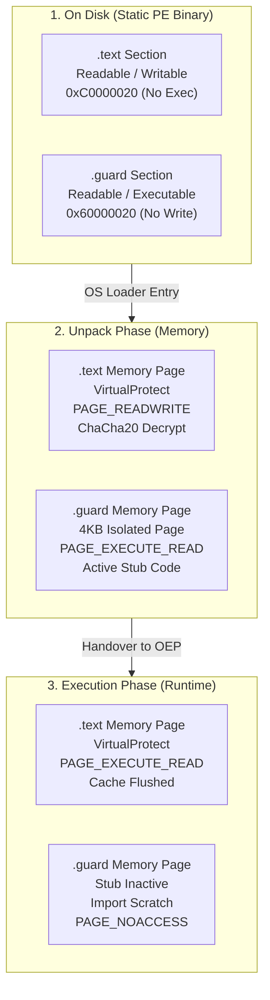
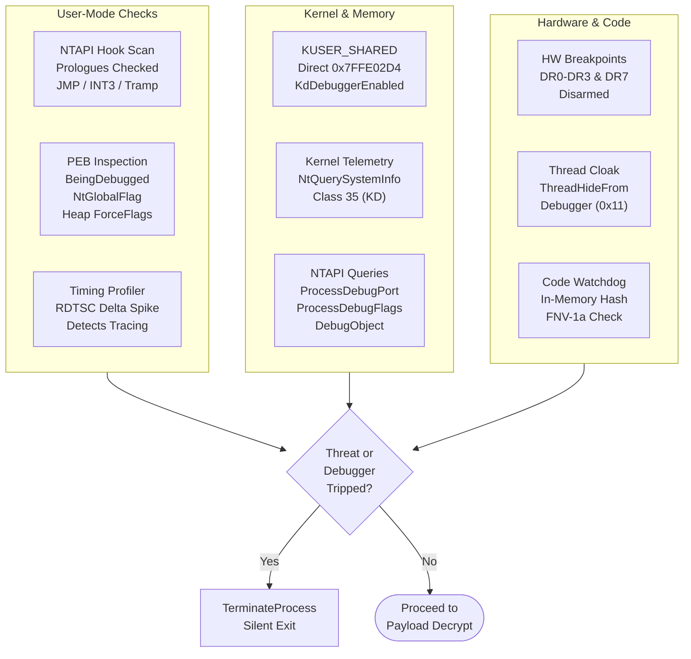
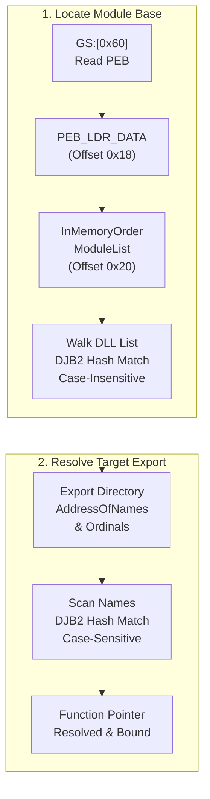
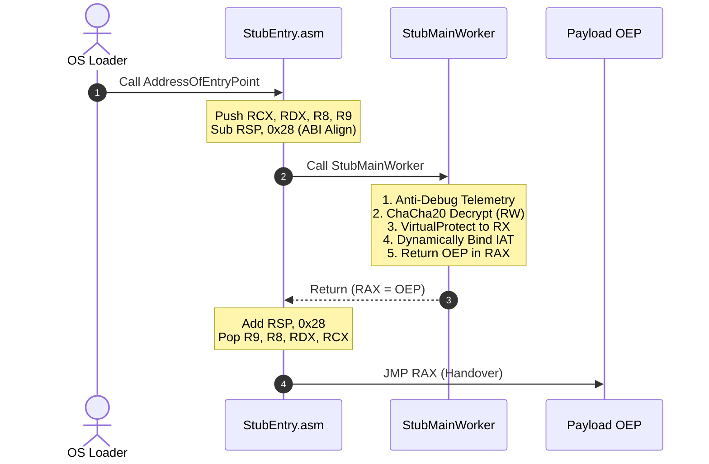

# IronVeil: Native x64 PE Protector & Anti-Tamper Engine

[](https://microsoft.com)
[](https://isocpp.org)
[-success.svg?style=flat)]()
[]()
[](LICENSE)

IronVeil is a native, production-grade 64-bit Windows PE (Portable Executable) binary protector and anti-tamper runtime engine. Engineered specifically for high-assurance reverse engineering mitigation without tripping heuristic or false-positive alarms, IronVeil rejects legacy packing clichés (such as RWX memory pages and noisy kernel-driver dependencies) in favor of **strict $W \oplus X$ memory semantics**, **freestanding CRT-less stub architecture**, and **hardware/kernel-grade anti-analysis telemetry**.

> [!NOTE]
> **Attribution & Transparency Notice**:
> The README documentation, architectural write-ups, and markdown diagrams in this repository were structured and documented with the assistance of AI. The entire C++17 and MASM x64 codebase, engine architecture, anti-tamper logic, PE parser/builder, and low-level unpacking mechanics were handcrafted, designed, and implemented directly by the author (**Draxo.dev** / **DaddyZyn**).

---

## High-Level Architecture & Lifecycle



---

## Core Technical Primitives

### 1. Strict $W \oplus X$ Memory Transition Matrix
Legacy packers typically flag `.text` or stub sections as `0xE0000020` (`PAGE_EXECUTE_READWRITE` / RWX), immediately tripping endpoint heuristics, AV/EDR emulators, and hypervisor-based memory scanners. 

IronVeil enforces mathematical $W \oplus X$ invariance across every phase of execution:



- **Physical Page Boundary Isolation**: Stub execution code and encrypted import payloads are separated across distinct 4KB virtual memory pages. Calling `VirtualProtect` on runtime data structures never crosses page boundaries to alter executable code pages.
- **Microarchitectural Flush**: Immediate invocation of `FlushInstructionCache` following the transition from `PAGE_READWRITE` to `PAGE_EXECUTE_READ` ensures stale CPU decodes and speculation pipelines cannot execute out-of-order prefetch bytes.

---

### 2. Multi-Tier Anti-Analysis & Tamper Detection

IronVeil implements a layered detection graph that executes prior to any section decryption:



#### Detailed Mitigation Strategies:
1. **NTAPI Inline Hook & Trampoline Detection**: Proactively inspects the entry opcodes of critical NT exports (`NtQueryInformationProcess`, `NtSetInformationThread`, `VirtualProtect`) to detect userland interception trampolines commonly installed by analysis harnesses (ScyllaHide, MinHook, Frida, Detours):
   - `0xE9` (JMP rel32)
   - `0xCC` (INT 3 breakpoint)
   - `0xFF 0x25` (JMP QWORD PTR [RIP+disp32] pointing outside module boundaries)
   - `0x48 0xB8 ... 0xFF 0xE0` (MOV RAX, imm64; JMP RAX absolute detour)
2. **KUSER_SHARED_DATA Inspection**: Directly queries user-mode shared kernel page `0x7FFE02D4` (`KdDebuggerEnabled`) while validating `0x7FFE02D5` (`KdDebuggerNotPresent`). Because this read is a direct memory dereference without API calls, it cannot be intercepted by userland hook frameworks, while dual-checking prevents false alarms under Hyper-V or test-signing configurations.
3. **Kernel Debugger Telemetry**: Dynamically queries `NtQuerySystemInformation` with `SystemKernelDebuggerInformation` (`0x23` / 35), exposing ring-0 kernel debugger attachments (WinDbg, KD).
4. **Hardware Breakpoint Disarming**: Obtains thread context and scans debug registers (`DR0`, `DR1`, `DR2`, `DR3`, `DR6`, `DR7`). Any active hardware breakpoint triggers immediate termination.
5. **Multi-Sample RDTSCP Jitter Profiler**: Measures clock cycle differentials using serialized `__rdtscp` across multiple passes and evaluates the minimum delta. This rejects OS scheduler thread-switch outliers in high-load and virtualized production environments while reliably detecting human single-stepping and debugger stepping traps.
6. **FNV-1a In-Memory Code Watchdog**: Computes a clean-room 64-bit FNV-1a hash over the decrypted code space and compares it against the build-time reference hash, neutralizing inline patches or software breakpoints injected during unpacking.

---

### 3. Freestanding In-Memory Dynamic Resolver



- **Zero External Dependencies**: Stub binary does not link against the MSVC runtime (`/NODEFAULTLIB`) or import any dynamic libraries.
- **Hash-Based Export Resolution**: DLL names and exported API names are never stored as plaintext strings in the binary; all lookups rely on compile-time salted DJB2 hashes.
- **Post-Unpack Sanitization**: As soon as modules and APIs are dynamically loaded and bound into the program's real IAT, all intermediate decryption buffers and plaintext string metadata are wiped with zeroes and converted to `PAGE_NOACCESS`.

---

### 4. Native x64 ABI Stack Alignment & Handover

Windows x64 ABI requires strict 16-byte stack alignment whenever an external function or entry point is invoked (`(RSP - 8)` must be a multiple of 16). Deviations result in immediate access violations (`0xC0000005`) when calling SIMD/SSE instructions (`movaps`).

IronVeil manages register preservation and ABI alignment via a dedicated assembly trampoline:



---

## Directory Structure

```
IronVeil/
├── CMakeLists.txt              # Unified build configuration (Protector CLI + Freestanding Stub)
├── build.bat                   # Automated MSVC / CMake Release build script
├── LICENSE                     # MIT License
├── README.md                   # Technical documentation
├── include/
│   ├── Common.hpp              # Core structs, StubConfig, hashes, and section descriptors
│   ├── Encryptor.hpp           # 256-bit ChaCha20 stream cipher & PRNG definitions
│   ├── PeBuilder.hpp           # PE modification, section injection, and stub packing engine
│   └── PeParser.hpp            # Raw PE32+ header parsing and IAT extraction
├── src/
│   ├── Encryptor.cpp           # ChaCha20 quarter-round and crypt routines
│   ├── PeBuilder.cpp           # Section alignment, PE header patching, import encryption
│   ├── PeParser.cpp            # PE structure traversal, RVA-to-offset calculation
│   └── main.cpp                # Protector CLI entry point
└── stub/
    ├── AntiDebug.hpp           # NTAPI hook scan, KUSER_SHARED_DATA, DRx, RDTSC checks
    ├── DynamicResolver.hpp     # Freestanding PEB/Ldr DJB2 dynamic API resolution
    ├── StubEntry.asm           # MASM x64 entry trampoline & ABI stack alignment
    └── StubMain.cpp            # Freestanding runtime unpacker orchestration
```

---

## Building IronVeil

### Prerequisites
- **Operating System**: Windows 10 or 11 (x64)
- **Compiler**: Visual Studio 2019 / 2022 (with Desktop Development with C++)
- **Assembler**: Microsoft Macro Assembler (`ml64.exe` included with Visual Studio)
- **Build System**: CMake 3.15+

### Automated Build
Run the provided automated build script:
```cmd
build.bat
```

### Manual CMake Build
```cmd
mkdir build && cd build
cmake -A x64 ..
cmake --build . --config Release
```

All binaries will be generated inside `bin/Release/`:
- `IronVeil.exe`: The primary command-line binary protector.
- `IronVeilStub.dll`: The freestanding runtime unpacking stub library.

---

## Usage

```cmd
IronVeil.exe <input.exe> [output.exe] [options]
```

### CLI Parameters & Options
| Argument / Flag | Type | Description |
| :--- | :--- | :--- |
| `<input.exe>` | Required | Path to the target 64-bit Windows PE executable. |
| `[output.exe]` | Optional | Path for the protected binary (default: `<input>_protected.exe`). |
| `--encrypt-rdata` | Flag | Encrypts the `.rdata` read-only data section alongside `.text`. |
| `--no-antidebug` | Flag | Disables runtime anti-debugging telemetry (for developer debugging). |
| `--section-name <str>` | String | Custom name for the injected stub section header (default: `.guard`). |
| `--help`, `-h` | Flag | Displays the CLI help menu. |

### Practical Example
Protect a release executable with full anti-debug defenses and a custom section header:
```cmd
bin\Release\IronVeil.exe ProductionApp.exe ProductionApp_Secured.exe --section-name .shield
```

---

## Technical Specifications

| Parameter | Specification |
| :--- | :--- |
| **Architecture** | Windows x64 (AMD64) |
| **Payload Encryption** | ChaCha20 (256-bit key, 96-bit nonce, unique stream counters per section) |
| **Integrity Algorithm** | 64-bit FNV-1a post-decryption hash verification |
| **API Obfuscation** | 32-bit compile-time DJB2 hash resolution |
| **Memory Characteristics** | Strict $W \oplus X$ (RW on-disk for code, flipped to RX at runtime; zero RWX pages) |
| **Page Alignment** | 4,096-byte boundary isolation between stub code and dynamic import tables |
| **Runtime Dependencies** | None (`/NODEFAULTLIB`, zero C runtime / external DLL import references) |

---

## License

This project is licensed under the MIT License. See [LICENSE](LICENSE) for details.
